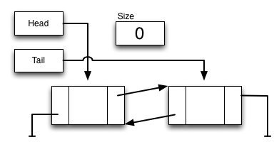

# Lab 5 -- Link 'em up!
## Part 1 -- Doubly Linked Lists

Your first task is to implement a doubly linked list called `MyLinkedList<T>`.

### MyLinkedList

In this lab you will implement a class called `MyLinkedList<T>`. Your class is just a subset of `LinkedList`, and therefore should match its behavior on this subset.

Your class will extend `AbstractList<T>` and later in this lab you will create
a `ListIterator` as a [nested
class](http://docs.oracle.com/javase/tutorial/java/javaOO/nested.html).

When you have finished your implementation, be sure to test it thoroughly
before continuing. In doubly linked lists, the removal of items can be
especially tricky as you need to be sure to properly update all of the
pointers of the next and previous elements, as well as handle the special
cases for removal from the front or tail. Keep a piece of paper with you and
draw pictures to help with your coding. Nobody writes this code without
referring to pictures.

You should not allow `null` values to be inserted into the list; if the user
of your class attempts to do so, you should throw a `NullPointerException`.

### Constructors

You should only need to have a single public 0-argument constructor that
creates an empty list and initializes all the necessary variables.



### Private Methods

`private Node getNth(int index)`
: Returns the `Node` (not the node’s content) at a specified index.

`private removeNode(Node n)`
: Removes `n` from the linked list.
{: .implement-box}

### Public Methods

`public boolean add(T data)`

`public void add(int index, T data)`
: Add an element into this list (either at end or at `index`).

  Throw a `NullPointerException` if the user tries to add `null`.
  Throw an `IndexOutOfBoundsException` as needed (same rules as `MyArrayList`)

  Note: the boolean `add()` method will always return `true`; it is a boolean
  function due to the method definition in `AbstractList`.

`public T get(int index)`
: Return the element at position `index`.

  Throw `IndexOutOfBoundsException` as needed.

`public T set(int index, T data)`
: Set the value at index `index` to `data`, return the old value.

  Throw a `NullPointerException` if `data` is `null` and throw an
  `IndexOutOfBoundsException` as needed.

`public T remove(int index)`
: Remove (and return) the element at position `index` in this list.

  Throw an `IndexOutOfBoundsException` as needed.

`public void clear()`
: Remove all elements from the list.

`public boolean isEmpty()`:
: Returns `true` if the list is empty.

`public int size()`
: Returns the number of elements in the list.
{: .implement-box}

### Testing your List

You should be able to re-use the tests you wrote in Lab 3 for `MyArrayList`.
Create a new JUnit test called `MyLinkedListTest.java` and paste the code from
`MyArrayListTest.java` into it. Then you can open up the file, rename the
public class to be `MyLinkedListTest`, and then update the methods to use
`MyLinkedList`s instead of `MyArrayList`s. Just change `MyArrayList` to
`MyLinkedList` throughout so you get lines like this.
```java
MyLinkedList<String> x = new MyLinkedList<String>();
```
