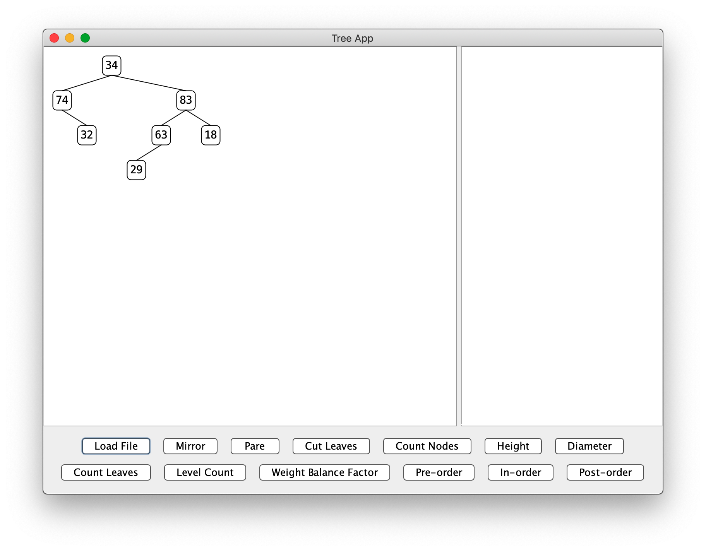

# Lab 6 -- Binary Trees
## Part 1 -- Overview

### BinaryTree
As you may recall from class, a binary tree is either
1. empty, or
2. a root node of data with a left and right (sub)tree.

The starter code has three tree classes.
1. An abstract class `BinaryTree<T>` to represent any binary tree,
2. A subclass `EmptyTree<T>` of `BinaryTree<T>` to represent any empty binary
   tree. _Note that we are using this class and **not** `null` to represent
   empty trees._
3. A subclass `ConsTree<T>` of `BinaryTree<T>` to represent any nonempty
   binary tree. This class contains fields appropriate for a nonempty binary
   tree.

In this way, any binary tree you create will either be an `EmptyTree` or a `ConsTree`. 

### TreeApp

You should be able to run the `TreeApp` program. It doesn't do much yet. There
is a `Load File` button that brings up a file picker that allows you to choose
from various tree files that have been supplied, but nothing happens when you
choose a file because the `loadTreeFromFile()` method at this point just returns
a new `EmptyTree`. You will fix that in [Part 2](part2.html).

This application's GUI frame has a tree display area on the left, an output
textbox on the right, and a group of buttons for user commands at the bottom.
After you implement the `loadTreeFromFile()` method, when a file is loaded a
binary tree object will be created and the tree displayed in the left area of
the frame. The area on the right side of the frame is used for the output of
from buttons like `Height` and `Diameter`.

